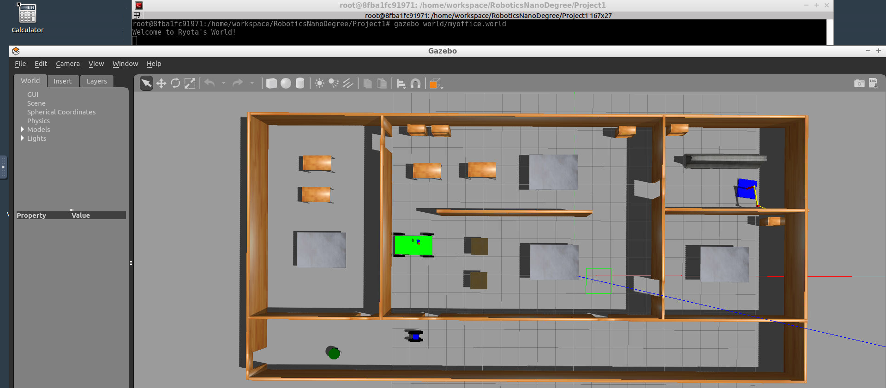

# Project 1: Build My World

## Directory Structure

Project1
|-- CMakeLists.txt
|-- model
|   |-- mybuilding
|   |   |-- model.config
|   |   `-- model.sdf
|   `-- simplerobot
|       |-- model.config
|       `-- model.sdf
|-- project1.png
|-- script
|   `-- hello.cpp
`-- world
    `-- myoffice.world