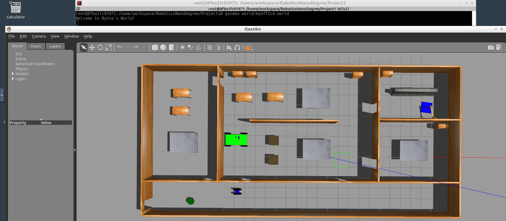

# Project 1: Build My World


## Overview
The first project of Udacity's Robotics Software Engineer Nanodegree. It focuses on building a custom simulation environment in Gazebo: an office-like world populated with objects from the Gazebo model database, two custom robot models, and a world plugin that runs when the world is loaded.

## Directory Structure
```
├── Project1
│   ├── CMakeLists.txt
│   ├── model
│   │   ├── mybuilding
│   │   │   ├── model.config
│   │   │   └── model.sdf
│   │   ├── simplerobot
│   │   │   ├── model.config
│   │   │   └── model.sdf
│   │   └── simplerobot2
│   │       ├── model.config
│   │       └── model.sdf
│   ├── project1.png
│   ├── README.md
│   ├── script
│   │   └── hello.cpp
│   └── world
│       └── myoffice.world
└── README.md
```

## Contents

### World: `world/myoffice.world`
An office environment built on the ground plane, populated with bookshelves, cafe tables, and a car model. It loads the `hello` world plugin at startup.

### Models: `model/`
- **mybuilding** — A custom building model used as the office structure.
- **simplerobot** / **simplerobot2** — Simple box-shaped robot models used to place robots in the world.

### Plugin: `script/hello.cpp`
A minimal Gazebo `WorldPlugin` that prints a greeting message to the console when the world is loaded, built as a shared library named `libhello.so`.

## Requirements
- Gazebo 7.0+
- CMake 2.8+

## Build & Run
```bash
# Build the world plugin
cd Project1
mkdir -p build && cd build
cmake ..
make

# Make the plugin discoverable by Gazebo
export GAZEBO_PLUGIN_PATH=$GAZEBO_PLUGIN_PATH:$(pwd)

# Launch the world
cd ..
gazebo world/myoffice.world
```
