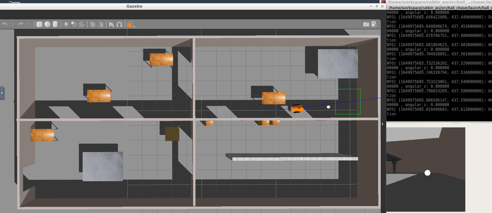

# Project 1: Build My World


## Directory Structure
```
Project2
|-- ball_chaser
|   |-- CMakeLists.txt
|   |-- include
|   |   `-- ball_chaser
|   |-- launch
|   |   `-- ball_chaser.launch
|   |-- package.xml
|   |-- src
|   |   |-- drive_bot.cpp
|   |   `-- process_image.cpp
|   `-- srv
|       `-- DriveToTarget.srv
`-- my_robot
    |-- CMakeLists.txt
    |-- launch
    |   |-- robot_description.launch
    |   `-- world.launch
    |-- meshes
    |   `-- hokuyo.dae
    |-- package.xml
    |-- urdf
    |   |-- my_robot.gazebo
    |   |-- my_robot.xacro
    |   `-- mybuilding
    |       |-- model.config
    |       `-- model.sdf
    `-- worlds
        `-- myoffice.world
```
