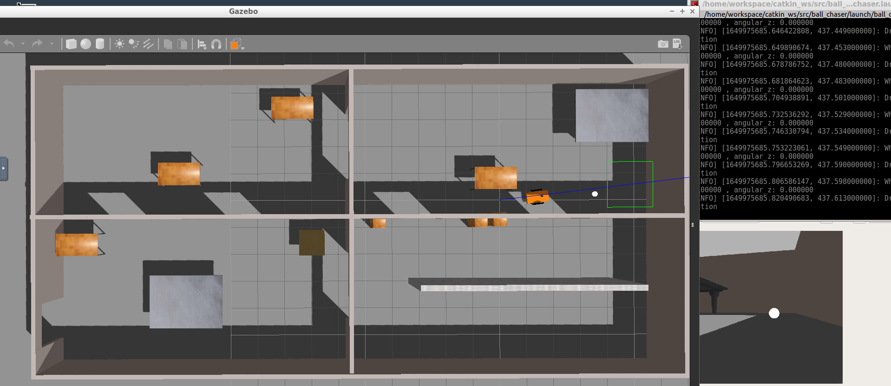

# Project 2: Go Chase It!


## Overview
The second project of Udacity's Robotics Software Engineer Nanodegree. A differential-drive robot spawned in a Gazebo world detects a white ball with its onboard camera and drives toward it using two custom ROS packages: `my_robot` (robot description and world) and `ball_chaser` (ball-chasing logic).

## Directory Structure
```
Project2
├── ball_chaser
│   ├── CMakeLists.txt
│   ├── package.xml
│   ├── launch
│   │   └── ball_chaser.launch
│   ├── src
│   │   ├── drive_bot.cpp
│   │   └── process_image.cpp
│   └── srv
│       └── DriveToTarget.srv
├── my_robot
│   ├── CMakeLists.txt
│   ├── package.xml
│   ├── launch
│   │   ├── robot_description.launch
│   │   └── world.launch
│   ├── meshes
│   ├── urdf
│   │   ├── my_robot.gazebo
│   │   ├── my_robot.xacro
│   │   └── mybuilding
│   │       ├── model.config
│   │       └── model.sdf
│   └── worlds
│       └── myoffice.world
└── README.md
```

## Contents

### Package: `my_robot/`
The robot description (`urdf/my_robot.xacro`, `urdf/my_robot.gazebo`) for a differential-drive robot equipped with a camera and a Hokuyo lidar, along with the `myoffice.world` Gazebo world it is spawned into.

### Package: `ball_chaser/`
- **`drive_bot.cpp`** — Advertises the `/ball_chaser/command_robot` service (`DriveToTarget.srv`). On each request it publishes a `geometry_msgs/Twist` on `/cmd_vel` with the requested linear/angular velocities.
- **`process_image.cpp`** — Subscribes to `/camera/rgb/image_raw`, scans the image for white pixels to locate the ball, and calls `/ball_chaser/command_robot` to steer the robot left, right, or forward, stopping when no ball is detected.
- **`DriveToTarget.srv`** — Service definition: request (`linear_x`, `angular_z`) / response (`msg_feedback`).

## Requirements
- ROS (Kinetic/Melodic)
- Gazebo
- catkin workspace

## Build & Run
```bash
# Copy Project2 packages into your catkin workspace
cp -r Project2/my_robot Project2/ball_chaser ~/catkin_ws/src/

# Build
cd ~/catkin_ws
catkin_make
source devel/setup.bash

# Launch the robot in the Gazebo world
roslaunch my_robot world.launch

# In a separate terminal, launch the ball-chasing nodes
roslaunch ball_chaser ball_chaser.launch
```
