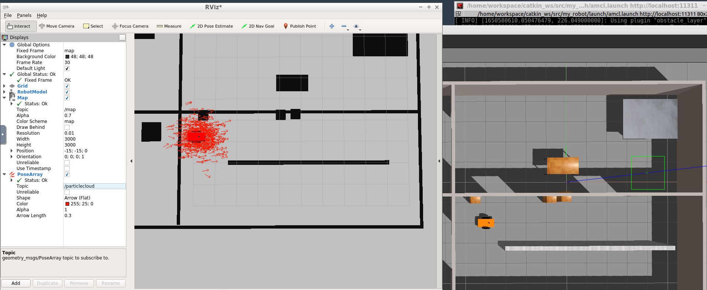
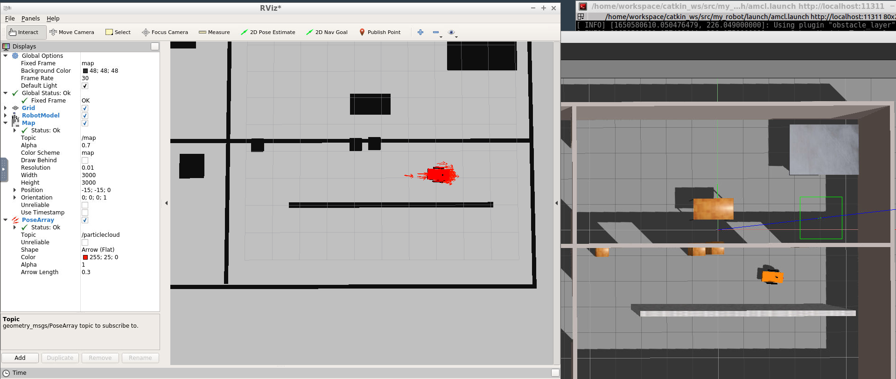

# Project 3: Where Am I?

Initial pose


After navigation


## Directory Structure
```
Project3
|-- CMakeLists.txt -> /opt/ros/kinetic/share/catkin/cmake/toplevel.cmake
|-- my_robot
|   |-- CMakeLists.txt
|   |-- config
|   |   |-- __MACOSX
|   |   |-- base_local_planner_params.yaml
|   |   |-- costmap_common_params.yaml
|   |   |-- global_costmap_params.yaml
|   |   `-- local_costmap_params.yaml
|   |-- launch
|   |   |-- amcl.launch
|   |   |-- robot_description.launch
|   |   `-- world.launch
|   |-- maps
|   |   |-- map.pgm
|   |   `-- map.yaml
|   |-- meshes
|   |   `-- hokuyo.dae
|   |-- package.xml
|   |-- urdf
|   |   |-- my_robot.gazebo
|   |   |-- my_robot.xacro
|   |   `-- mybuilding
|   |       |-- model.config
|   |       `-- model.sdf
|   `-- worlds
|       `-- myoffice.world
|-- pgm_map_creator
|   |-- CMakeLists.txt
|   |-- CODEOWNERS
|   |-- LICENSE
|   |-- README.md
|   |-- launch
|   |   `-- request_publisher.launch
|   |-- maps
|   |   `-- map.pgm
|   |-- msgs
|   |   |-- CMakeLists.txt
|   |   `-- collision_map_request.proto
|   |-- package.xml
|   |-- src
|   |   |-- collision_map_creator.cc
|   |   `-- request_publisher.cc
|   `-- world
|       |-- myoffice.world
|       `-- udacity_mtv
`-- teleop_twist_keyboard
    |-- CHANGELOG.rst
    |-- CMakeLists.txt
    |-- README.md
    |-- package.xml
    `-- teleop_twist_keyboard.py
```
