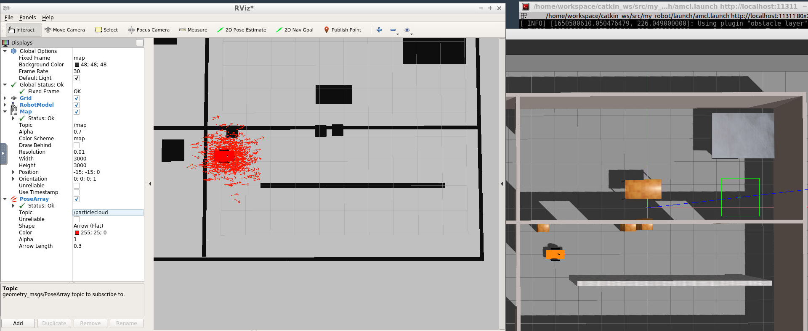
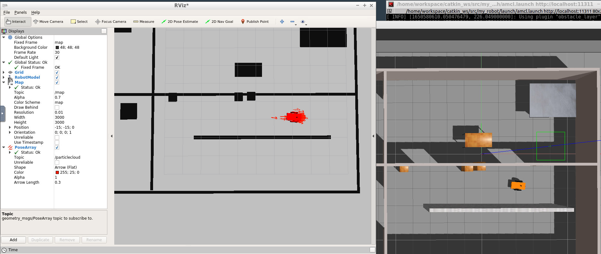

# プロジェクト3：Where Am I?

Udacity Robotics Software Engineer Nanodegreeの第3プロジェクトです。Gazebo上のロボットを既知の地図上で動かし、AMCL（Adaptive Monte Carlo Localization）による自己位置推定と、ROS Navigation Stackによるナビゲーションを行います。

## 実行例

初期位置をRVizで設定した状態と、ナビゲーション後の状態です。





## ディレクトリ構成

```
Project3
├── CMakeLists.txt
├── my_robot
│   ├── CMakeLists.txt
│   ├── config
│   │   ├── base_local_planner_params.yaml
│   │   ├── costmap_common_params.yaml
│   │   ├── global_costmap_params.yaml
│   │   └── local_costmap_params.yaml
│   ├── launch
│   │   ├── amcl.launch
│   │   ├── robot_description.launch
│   │   └── world.launch
│   ├── maps
│   │   ├── map.pgm
│   │   └── map.yaml
│   ├── meshes
│   │   └── hokuyo.dae
│   ├── package.xml
│   ├── urdf
│   │   ├── my_robot.gazebo
│   │   ├── my_robot.xacro
│   │   └── mybuilding
│   └── worlds
│       └── myoffice.world
├── pgm_map_creator
├── project3_after_nav.png
├── project3_initial_pose.png
└── teleop_twist_keyboard
```

## 必要環境

- UbuntuとROS（KineticまたはMelodic）
- Gazebo
- catkinワークスペース
- ROSパッケージ：`gazebo_ros`、`xacro`、`amcl`、`map_server`、`move_base`、`rviz`とNavigation Stack関連パッケージ

## ビルドと実行

Project3の`my_robot`パッケージをcatkinワークスペースにコピーしてビルドします。

```bash
mkdir -p ~/catkin_ws/src
# リポジトリのルートディレクトリで実行
cp -r Project3/my_robot ~/catkin_ws/src/
cd ~/catkin_ws
catkin_make
source devel/setup.bash
```

GazeboとRVizを起動します。

```bash
roslaunch my_robot world.launch
```

別のターミナルで、同じワークスペースの環境を読み込んでからAMCL、地図サーバー、ナビゲーションを起動します。

```bash
cd ~/catkin_ws
source devel/setup.bash
roslaunch my_robot amcl.launch
```

RVizで「2D Pose Estimate」を選び、地図上でロボットの初期位置と向きを指定します。自己位置が推定されたら、「2D Nav Goal」で目標位置を指定すると、ロボットがそこまで移動します。
