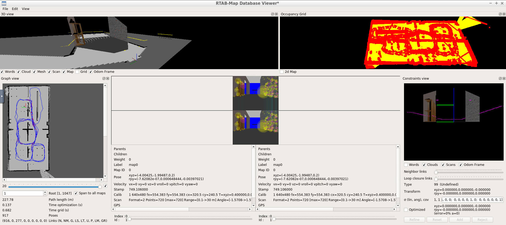
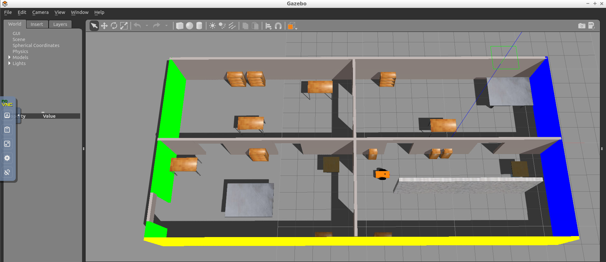

# Project 4: Map My World

Rtabmap-DatabaseViewer


Gazebo map


## Directory Structure
```
Project4
├── CMakeLists.txt -> /opt/ros/kinetic/share/catkin/cmake/toplevel.cmake
├── my_robot
│   ├── CMakeLists.txt
│   ├── config
│   │   ├── base_local_planner_params.yaml
│   │   ├── costmap_common_params.yaml
│   │   ├── global_costmap_params.yaml
│   │   ├── local_costmap_params.yaml
│   │   └── __MACOSX
│   ├── launch
│   │   ├── amcl.launch
│   │   ├── mapping.launch
│   │   ├── robot_description.launch
│   │   └── world.launch
│   ├── maps
│   │   ├── map.pgm
│   │   └── map.yaml
│   ├── meshes
│   │   └── hokuyo.dae
│   ├── package.xml
│   ├── urdf
│   │   ├── mybuilding
│   │   │   ├── model.config
│   │   │   └── model.sdf
│   │   ├── my_robot.gazebo
│   │   └── my_robot.xacro
│   └── worlds
│       └── myoffice.world
├── README.md
└── teleop_twist_keyboard
    ├── CHANGELOG.rst
    ├── CMakeLists.txt
    ├── package.xml
    ├── README.md
    └── teleop_twist_keyboard.py
```
