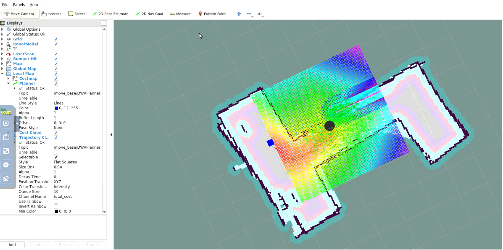
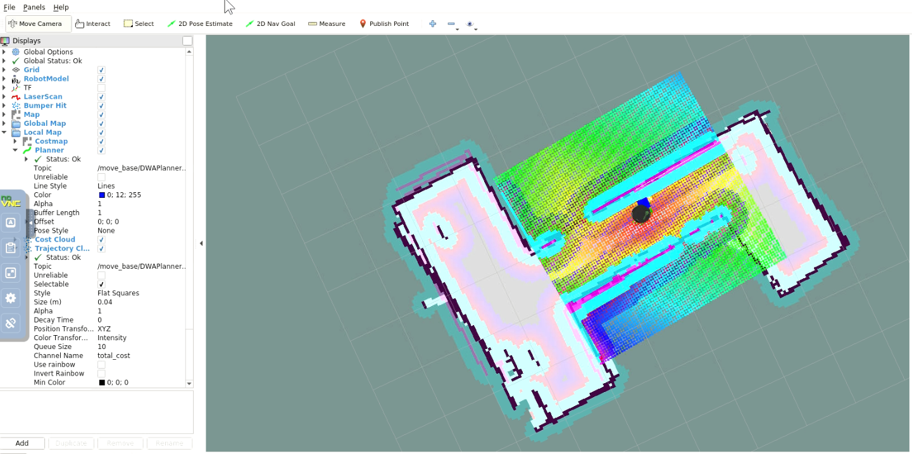

# Project 5: Home Service Robot

# How to run this project
## Build
```
cd /home/workspace/
git clone https://github.com/akeryo260/RoboticsNanoDegree.git
mkdir -p catkin_ws/src
cd catkin_ws/src
cp -Rf /home/workspace/RoboticsNanoDegree/Project5/* .
git clone https://github.com/ros-perception/slam_gmapping
git clone https://github.com/turtlebot/turtlebot
git clone https://github.com/turtlebot/turtlebot_interactions
git clone https://github.com/turtlebot/turtlebot_simulator
cd /home/workspace/catkin_ws
catkin_make
source devel/setup.bash
rosdep -i install gmapping
rosdep -i install turtlebot_teleop
rosdep -i install turtlebot_rviz_launchers
rosdep -i install turtlebot_gazebo
```

## Run
### SLAM Testing
map the environment designed with the Building Editor in Gazebo
cd /home/workspace/catkin_ws
./src/scripts/test_slam.sh

### Localization and Navigation Testing
test robot's ability to reach goals using the ROS Navigation stack
cd /home/workspace/catkin_ws
./src/scripts/test_navigation.sh

### Reaching Multiple Goals
send successive goals for my robot by a node 
that will communicate with the ROS navigation stack
cd /home/workspace/catkin_ws
./src/scripts/pick_objects.sh

### Modeling Virtual Objects
model a virtual object with markers in rviz
cd /home/workspace/catkin_ws
./src/scripts/add_markers.sh

### Your Home Service Robot
simulate a full home service robot navigating to pick up 
and delivering virtual objects
cd /home/workspace/catkin_ws
./src/scripts/home_service.sh

travel to pickup zone


drop off virtual object


