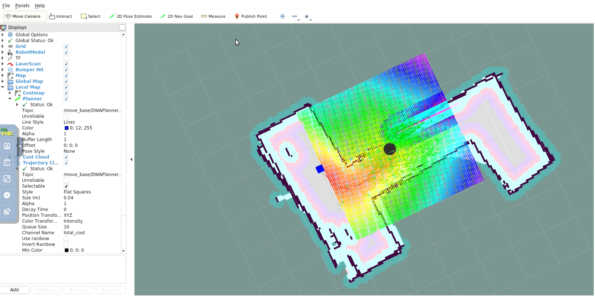
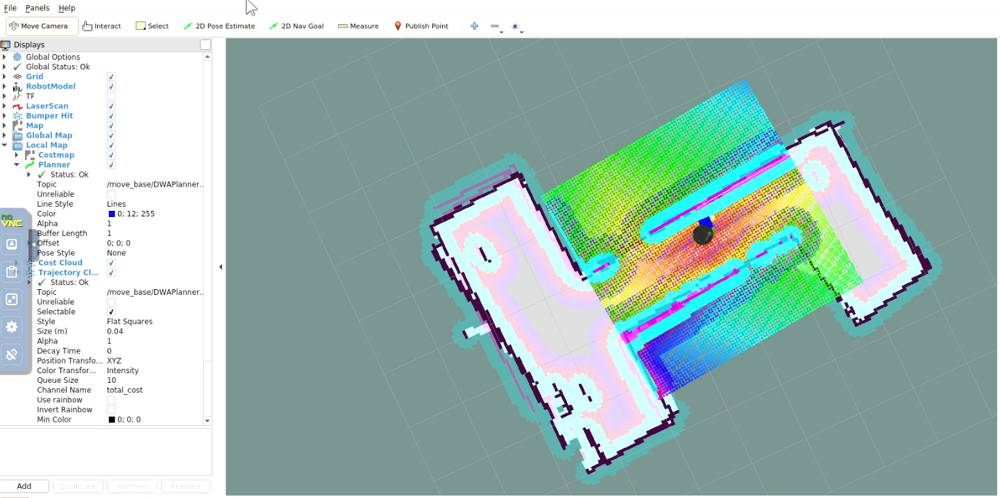

# Project 5: Home Service Robot

This project implements a simulated home service robot with ROS. A TurtleBot
localizes itself on a prebuilt map, navigates from the pickup zone to the
drop-off zone, and visualizes the virtual object in RViz.





## Features

- Starts a TurtleBot in the custom Gazebo office world (`map/myoffice.world`).
- Uses AMCL and the ROS Navigation Stack with the saved map
  (`map/myMap.yaml`).
- Sends sequential `move_base` goals to the pickup zone `(-2.0, 0.3)` and
  drop-off zone `(1.0, 0.0)`.
- Publishes a blue cube on `visualization_marker`: it is hidden while the
  robot transports the object and reappears at the drop-off zone.

## Requirements

- Ubuntu with ROS Kinetic and Gazebo
- A catkin workspace
- `xterm` (the supplied scripts launch each ROS process in a separate terminal)
- ROS packages: `turtlebot_gazebo`, `turtlebot_navigation`,
  `turtlebot_rviz_launchers`, `turtlebot_teleop`, `gmapping`, `amcl`, and
  `move_base`

## Setup

Create a workspace, clone the repository, and copy this project into the
workspace source directory:

```bash
mkdir -p ~/catkin_ws/src
cd ~/catkin_ws/src
git clone https://github.com/akeryo260/RoboticsNanoDegree.git
cp -R RoboticsNanoDegree/Project5/. .
rm -rf RoboticsNanoDegree

cd ~/catkin_ws
rosdep install --from-paths src --ignore-src -r -y
catkin_make
source devel/setup.bash
chmod +x src/scripts/*.sh
```

If the TurtleBot packages are not already present, install them with the ROS
package manager for your distribution, for example:

```bash
sudo apt-get install ros-kinetic-turtlebot-simulator \
  ros-kinetic-turtlebot-navigation \
  ros-kinetic-turtlebot-rviz-launchers \
  ros-kinetic-turtlebot-teleop \
  ros-kinetic-slam-gmapping
```

## Run

Run the following commands from the workspace root after sourcing
`devel/setup.bash`. Each script opens the required nodes in separate `xterm`
windows. Close the spawned terminals to stop a run.

| Script | Purpose |
| --- | --- |
| `./src/scripts/test_slam.sh` | Launch Gazebo, GMapping, RViz, and keyboard teleoperation to create a map. |
| `./src/scripts/test_navigation.sh` | Launch Gazebo, AMCL, and RViz to test localization and manually set navigation goals. |
| `./src/scripts/pick_objects.sh` | Send the pickup and drop-off goals through `move_base`. |
| `./src/scripts/add_markers.sh` | Demonstrate the marker lifecycle on a timer: show at pickup, hide, then show at drop-off. |
| `./src/scripts/home_service.sh` | Run the complete home-service demonstration. |

For the complete demonstration:

```bash
cd ~/catkin_ws
source devel/setup.bash
./src/scripts/home_service.sh
```

The demo starts Gazebo, AMCL/navigation, the custom RViz configuration,
`add_markers_node`, and `pick_objects_node`. The marker node detects the
robot's `/odom` position within 1 m of each zone; the navigation node waits
five seconds at the pickup zone before sending the drop-off goal.

## Packages

### `pick_objects`

`pick_objects_node` is an `actionlib` client for `move_base`. It waits for the
action server, sends the pickup goal, waits for success, pauses for five
seconds to simulate pickup, then sends the drop-off goal.

### `add_markers`

`add_markers_node` publishes the blue cube marker in the `map` frame and
subscribes to `/odom` to control its state:

1. Show the marker at the pickup zone.
2. Delete it when the robot reaches the pickup zone.
3. Add it at the drop-off zone when the robot reaches that zone.

`add_markers_timer` provides the same visual sequence using fixed delays for
the standalone marker test.

## Project layout

```text
Project5/
├── add_markers/             # RViz marker publisher nodes
├── pick_objects/            # Sequential move_base goal client
├── map/
│   ├── myMap.pgm            # Occupancy grid
│   ├── myMap.yaml           # Map metadata
│   └── myoffice.world       # Gazebo office world
├── scripts/                 # Test and demonstration launch scripts
├── home_service.rviz        # RViz configuration
├── travel_to_pickup_zone.png
└── drop_off_virtual_object.png
```
