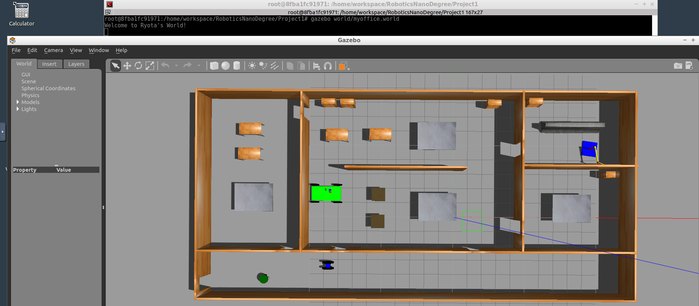
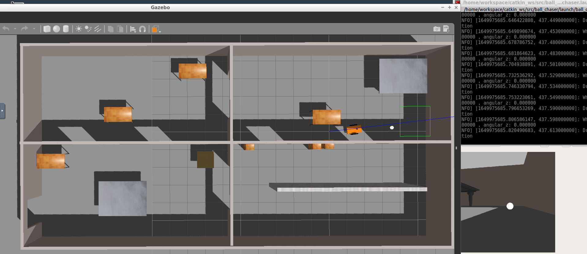
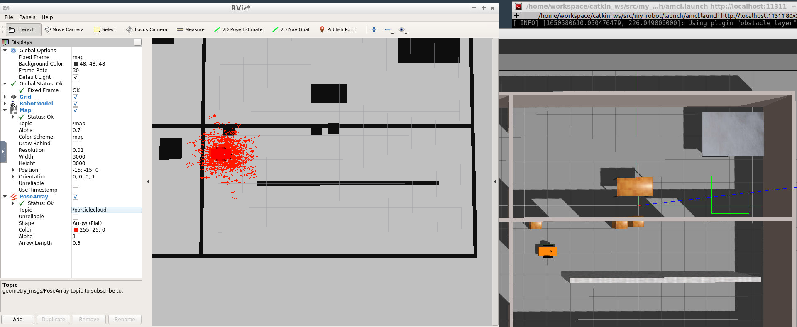
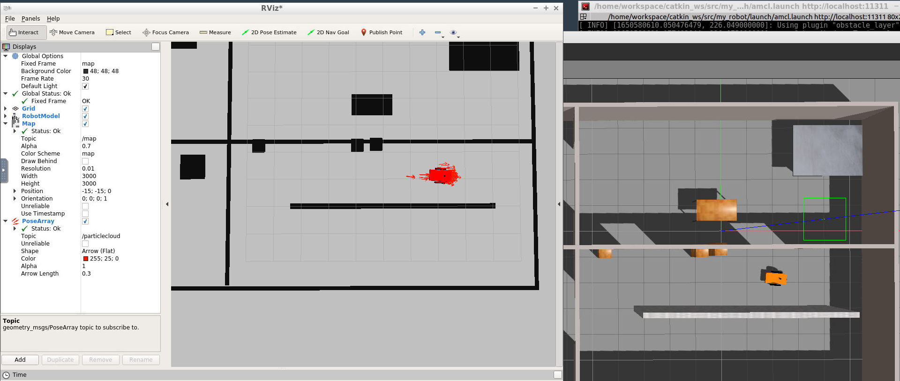
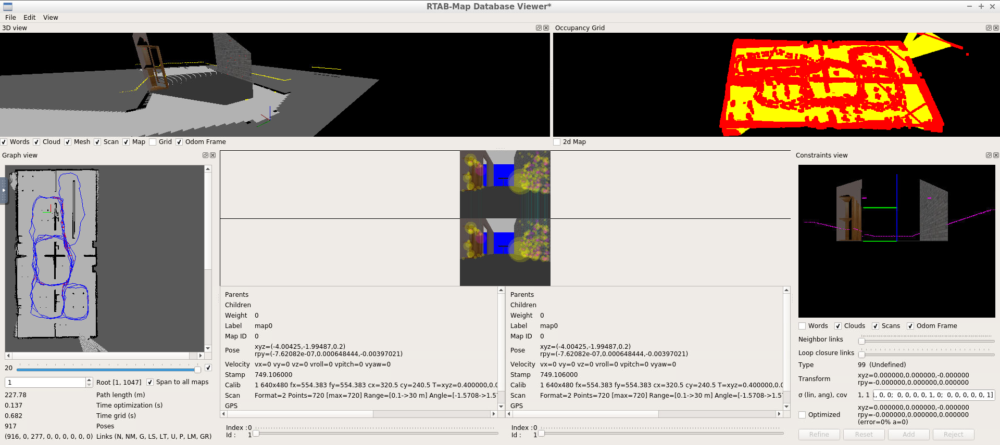
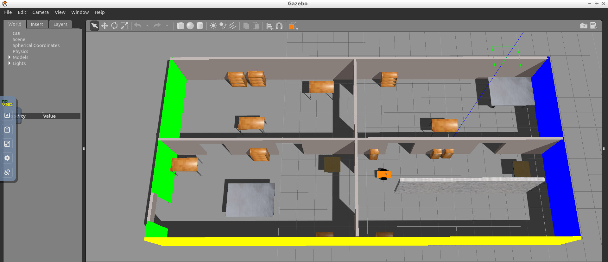
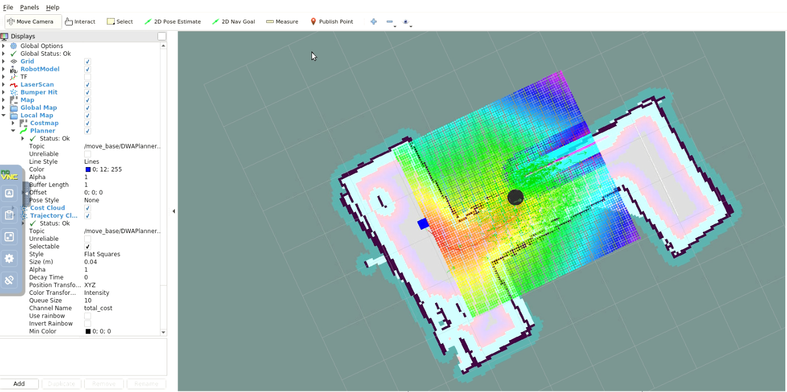
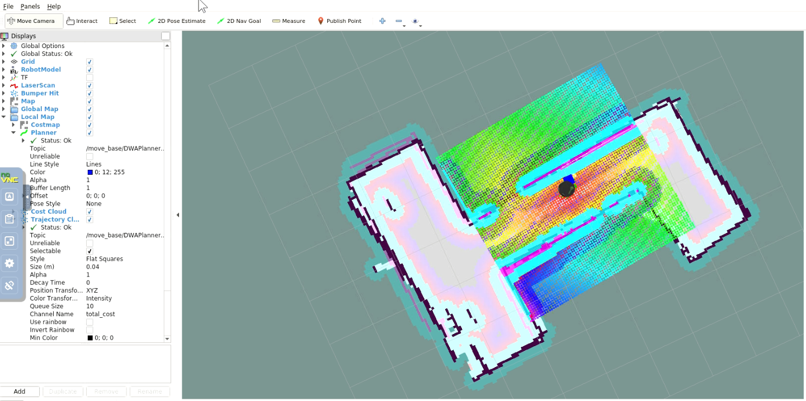

# Robotics Nanodegree プロジェクト概要

このリポジトリは、Udacity Robotics Nanodegreeプログラムの5つのプロジェクトで構成されています。各プロジェクトは、ROS (Robot Operating System)とGazeboシミュレーションを使用したロボティクスの異なる側面をカバーしています。

## 目次
- [プロジェクト1: Build My World](#プロジェクト1-build-my-world)
- [プロジェクト2: Go Chase It!](#プロジェクト2-go-chase-it)
- [プロジェクト3: Where Am I?](#プロジェクト3-where-am-i)
- [プロジェクト4: Map My World](#プロジェクト4-map-my-world)
- [プロジェクト5: Home Service Robot](#プロジェクト5-home-service-robot)
- [使用技術](#使用技術)
- [リポジトリ構造](#リポジトリ構造)

---

## プロジェクト1: Build My World

### 概要
Gazeboシミュレーション環境でカスタムロボットワールドを構築する最初のプロジェクトです。

### 主な内容
- Gazeboを使用したシミュレーション環境の作成
- カスタムロボットモデルの設計
- Building Editorを使用した建物の作成
- World PluginとModel Pluginの実装

### ディレクトリ構造
```
Project1/
├── CMakeLists.txt
├── model/                    # カスタムモデル
│   ├── mybuilding/          # 建物モデル
│   ├── simplerobot/         # ロボットモデル1
│   └── simplerobot2/        # ロボットモデル2
├── script/
│   └── hello.cpp            # C++プラグインスクリプト
└── world/
    └── myoffice.world       # Gazeboワールドファイル
```

### スクリーンショット


---

## プロジェクト2: Go Chase It!

### 概要
カメラ付きロボットを作成し、白いボールを認識して追跡するプロジェクトです。

### 主な内容
- URDFとXacroを使用したロボットモデルの作成
- カメラセンサーとLIDARセンサーの統合
- 画像処理による白いボールの検出
- ROSサービスを使用したロボット制御

### 主要パッケージ
- **my_robot**: ロボットモデルとGazebo環境
- **ball_chaser**: ボール追跡機能
  - `drive_bot.cpp`: ロボット駆動サービス
  - `process_image.cpp`: 画像処理とボール検出

### ディレクトリ構造
```
Project2/
├── ball_chaser/             # ボール追跡パッケージ
│   ├── src/
│   │   ├── drive_bot.cpp
│   │   └── process_image.cpp
│   ├── srv/
│   │   └── DriveToTarget.srv
│   └── launch/
└── my_robot/                # ロボットモデル
    ├── urdf/
    ├── meshes/
    └── worlds/
```

### スクリーンショット


---

## プロジェクト3: Where Am I?

### 概要
Adaptive Monte Carlo Localization (AMCL)を使用して、既知の地図内でロボットを位置推定するプロジェクトです。

### 主な内容
- ROS AMCLパッケージによる位置推定
- Navigationスタックの設定
- コストマップパラメータの調整
- キーボードによるロボットのテレオペレーション

### 主要機能
- **位置推定**: AMCLアルゴリズムによる正確な位置特定
- **ナビゲーション**: 目標地点への自律移動
- **マップ**: pgm_map_creatorを使用したマップ生成

### ディレクトリ構造
```
Project3/
├── my_robot/
│   ├── config/              # ナビゲーションパラメータ
│   ├── launch/
│   │   ├── amcl.launch
│   │   └── world.launch
│   └── maps/                # PGMマップファイル
├── pgm_map_creator/         # マップ生成ツール
└── teleop_twist_keyboard/   # キーボード制御
```

### スクリーンショット
初期姿勢:


ナビゲーション後:


---

## プロジェクト4: Map My World

### 概要
RTAB-Map (Real-Time Appearance-Based Mapping)を使用して、3D環境のマッピングとローカリゼーションを行うプロジェクトです。

### 主な内容
- RTAB-Mapによる3Dマッピング
- RGB-Dカメラを使用したSLAM
- データベースビューアーによる地図の可視化
- ループクロージャー検出

### 主要機能
- **3Dマッピング**: リアルタイムでの環境マッピング
- **ローカリゼーション**: 既存マップ内での位置推定
- **データベース**: RTABMapデータベースの保存と解析

### ディレクトリ構造
```
Project4/
├── my_robot/
│   ├── config/              # ナビゲーションパラメータ
│   ├── launch/
│   │   ├── mapping.launch   # マッピング用
│   │   ├── localization.launch
│   │   └── world.launch
│   └── maps/
└── teleop_twist_keyboard/   # キーボード制御
```

### スクリーンショット
RTAB-Map Database Viewer:


Gazeboマップ:


---

## プロジェクト5: Home Service Robot

### 概要
完全な自律ホームサービスロボットのシミュレーション。ロボットが仮想オブジェクトをピックアップして配達します。

### 主な内容
- TurtleBotシミュレーション
- SLAM（gmapping）による地図作成
- ナビゲーションスタックによる経路計画
- RVizマーカーによる仮想オブジェクトの可視化
- 複数の目標地点への移動

### 主要パッケージ
- **pick_objects**: ピックアップとドロップオフゾーンへのナビゲーション
- **add_markers**: RVizでの仮想オブジェクトの可視化
- **turtlebot_gazebo**: TurtleBotシミュレーション環境
- **turtlebot_rviz_launchers**: RViz可視化
- **slam_gmapping**: SLAMマッピング

### テストスクリプト
```bash
# SLAMテスト
./src/scripts/test_slam.sh

# ローカリゼーションとナビゲーションテスト
./src/scripts/test_navigation.sh

# 複数目標地点への移動
./src/scripts/pick_objects.sh

# 仮想オブジェクトのモデリング
./src/scripts/add_markers.sh

# ホームサービスロボット（完全版）
./src/scripts/home_service.sh
```

### ディレクトリ構造
```
Project5/
├── add_markers/             # RVizマーカーパッケージ
├── pick_objects/            # ナビゲーションパッケージ
├── map/                     # 生成されたマップ
├── scripts/                 # 実行スクリプト
└── home_service.rviz        # RViz設定
```

### スクリーンショット
ピックアップゾーンへの移動:


仮想オブジェクトのドロップオフ:


---

## 使用技術

### ソフトウェア・フレームワーク
- **ROS (Robot Operating System)**: ロボティクスミドルウェア
- **Gazebo**: 物理シミュレーター
- **RViz**: 3Dビジュアライゼーションツール
- **CMake**: ビルドシステム

### 主要なROSパッケージ
- **AMCL**: Adaptive Monte Carlo Localization
- **RTAB-Map**: Real-Time Appearance-Based Mapping
- **Navigation Stack**: 経路計画とナビゲーション
- **gmapping**: SLAM実装
- **TurtleBot**: ロボットシミュレーションプラットフォーム

### プログラミング言語
- **C++**: ロボット制御とプラグイン開発
- **Python**: スクリプトとユーティリティ
- **XML/YAML**: 設定ファイルとパラメータ

### センサーとアクチュエータ
- カメラセンサー（RGB、RGB-D）
- LIDARセンサー
- 差動駆動ロボット

---

## リポジトリ構造

```
RoboticsNanoDegree/
├── Project1/               # Build My World
│   ├── model/             # Gazeboモデル
│   ├── script/            # C++プラグイン
│   └── world/             # ワールドファイル
│
├── Project2/               # Go Chase It!
│   ├── ball_chaser/       # ボール追跡パッケージ
│   └── my_robot/          # ロボットモデル
│
├── Project3/               # Where Am I?
│   ├── my_robot/          # AMCLロボット
│   ├── pgm_map_creator/   # マップ生成
│   └── teleop_twist_keyboard/
│
├── Project4/               # Map My World
│   ├── my_robot/          # RTAB-Mapロボット
│   └── teleop_twist_keyboard/
│
├── Project5/               # Home Service Robot
│   ├── add_markers/       # マーカー表示
│   ├── pick_objects/      # ナビゲーション
│   ├── scripts/           # 実行スクリプト
│   └── map/               # マップファイル
│
└── README.md              # メインREADME
```

---

## セットアップと実行

### 前提条件
- Ubuntu 16.04以上
- ROS Kinetic以上
- Gazebo 7以上

### ビルド手順
各プロジェクトには独自のビルド手順がありますが、一般的な流れは以下の通りです：

```bash
# ワークスペースの作成
mkdir -p catkin_ws/src
cd catkin_ws/src

# プロジェクトファイルのコピー
cp -r /path/to/ProjectX/* .

# 依存関係のインストール
rosdep install --from-paths . --ignore-src -r -y

# ビルド
cd ..
catkin_make

# 環境のセットアップ
source devel/setup.bash
```

詳細な手順については、各プロジェクトのREADMEファイルを参照してください。

---

## 学習目標

このNanodegreeプログラムを通じて、以下のスキルを習得できます：

1. **Gazeboシミュレーション**: ロボット環境の設計と構築
2. **ROSの基礎**: ノード、トピック、サービスの理解
3. **センサー統合**: カメラとLIDARの使用
4. **ローカリゼーション**: AMCLを使用した位置推定
5. **マッピング**: SLAMとRTAB-Mapによる地図作成
6. **ナビゲーション**: 自律移動と経路計画
7. **システム統合**: 完全な自律システムの構築

---

## ライセンス

各プロジェクトのライセンスについては、個別のプロジェクトディレクトリを参照してください。

## 作成者

akeryo260

## 参考リンク

- [Udacity Robotics Nanodegree](https://www.udacity.com/course/robotics-software-engineer--nd209)
- [ROS Documentation](http://wiki.ros.org/)
- [Gazebo Tutorials](http://gazebosim.org/tutorials)
- [RTAB-Map](http://introlab.github.io/rtabmap/)
